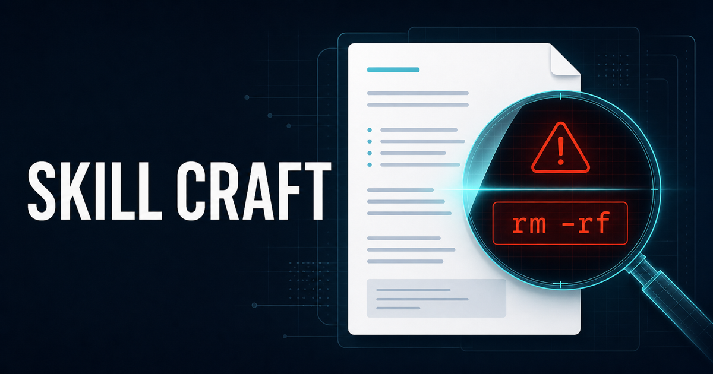

# Skill Craft

[](https://majarrah-marketplace.hashnode.dev/i-built-skill-craft-because-a-skill-can-look-right-and-still-fail-at-work)

[Read the article: **I Built Skill Craft — Because a Skill Can Look Right and Still Fail at Work**](https://majarrah-marketplace.hashnode.dev/i-built-skill-craft-because-a-skill-can-look-right-and-still-fail-at-work)

[](https://skills.sh/MuhammadBahaa/majarrah-marketplace)

Review and authoring craft for agent skills, custom agents, and plugins
by **Majarrah Nexus** — SkillCraft. Skills first; custom agents and
plugins are on the roadmap.

| Skill | What it does |
|---|---|
| `skill-craft-review` | Technical review of a skill/plugin: 10-dimension walk, safety scan, severity-mapped verdict, reviewer-stance rules, Decision close for the approver |
| `skill-walkthrough` | Guided, organized read of a skill: five-part plain-language walkthrough in clear ordered parts, your language; hands the approve call to skill-craft-review |

Both skills are built on the superpowers `writing-skills` skill v6.0.3
(MIT, (c) 2025 Jesse Vincent; vendored copy verified against upstream
through v6.1.1 — near-verbatim, one documented trim). Inherited versus
customized parts are
documented in each SKILL.md's Provenance section, per-check tags in
`skills/skill-craft-review/review-checklist.md`, and the near-verbatim
upstream copy in `skills/skill-craft-review/writing-skills-upstream.md`.
Test evidence:
`TESTING.md`.

## Install

**Claude Code**
```
claude plugin marketplace add MuhammadBahaa/majarrah-marketplace
/plugin install skill-craft@majarrah-marketplace
```

**Any agent via [skills.sh](https://skills.sh/MuhammadBahaa/majarrah-marketplace)**
(Claude Code, Codex, Cursor, Copilot, Gemini CLI, and 70+ others):
```
npx skills add MuhammadBahaa/majarrah-marketplace
```

**Manual copy (OpenAI Codex / Cursor / GitHub Copilot / Gemini CLI)**
All read the shared skills directory. Copy the skill folders into
`~/.agents/skills/` (user-wide) or `<project>/.agents/skills/` (per project):
```
git clone https://github.com/MuhammadBahaa/majarrah-marketplace
cp -r majarrah-marketplace/plugins/skill-craft/skills/* ~/.agents/skills/
```
Gemini CLI alternative: `gemini skills install <skill-folder-or-git-url>`.
Cursor and Copilot also read `~/.claude/skills`, so a Claude install covers them too.

## License

MIT.
